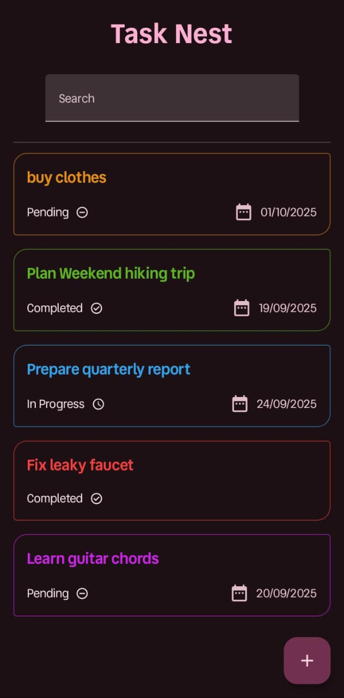
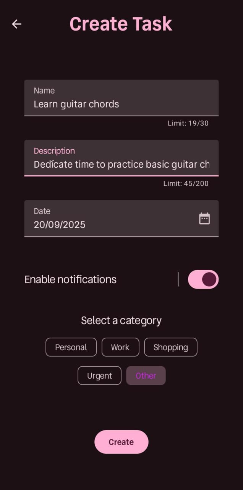
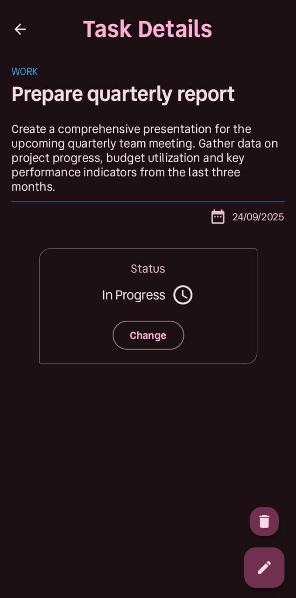

# 🪺 TaskNest

An Android app built with Jetpack Compose for managing tasks with categories, statuses, and notifications. Supports multiple languages and uses Room for local storage, Hilt for dependency injection, and WorkManager for scheduling notifications.

---

## 🚀 Features

- ✅ **Task Management**: Create, update, and delete tasks with name, description, date, category, and status.
- 🔔 **Notifications**: Schedule task reminders using WorkManager, with the option to enable/disable notifications.
- 🌐 **Multilanguage Support**: Available in multiple languages for user experience.
- 🔍 **Search**: Search tasks by name.
- 📊 **Task Organization**: Categorize tasks (Personal, Work, Shopping, Urgent, Other) and track their status (Pending, In Progress, Completed).

---

## 📸 Screenshots

| Home | Create/Edit Task | Task Details |
|-----------|---------------|--------------|
|  |  |  |

---

## 🧱 Tech Stack

- **UI**: Jetpack Compose
- **Local Database**: Room
- **Dependency Injection**: Hilt
- **Notifications**: WorkManager
- **Reactive Streams**: Kotlin Flow and StateFlow
- **Language Support**: Android Resource System for multilanguage
- **Architecture**: MVVM with Clean Architecture principles

---

## 🏛 Architecture

The app follows Clean Architecture with MVVM:
- **UI Layer**: Jetpack Compose screens observe ViewModel state and handle user events.
- **Domain Layer**: Use cases (`InsertTaskUseCase`, `UpdateTaskUseCase`, etc.) encapsulate business logic.
- **Data Layer**: Repository (`TaskRepository`) interacts with Room (`TaskDAO`) for data persistence.
- **Mappers**: Convert between domain models (`Task`) and database entities (`TaskEntity`).

---

## 📥 Download

You can download the APK from the releases folder:

[Download APK](https://github.com/nicolasCristaldo/Task_Nest_Android_Compose/blob/develop/app/release/task_nest.apk)

> **Note**: Ensure your device allows installation from unknown sources to install the APK. After clicking the link, select the "Download" button to get the file.
---

Made by [Nicolás Cristaldo](https://github.com/nicolasCristaldo)
